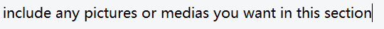

# Example lua

## info

> author: this is where you put your alias, keep it consistent\
> version: your current version number, do whatever you want with this field

## description

tells the readers what your lua does, and maybe how to use it.

## showcase

## credits
- who helped you on this script?
- whose script is this based on?
- if you worked on the script together, put them as co-authors instead of here!
- some random guy

## some random section
you may add as many sections as you wish as long as it's acceptable