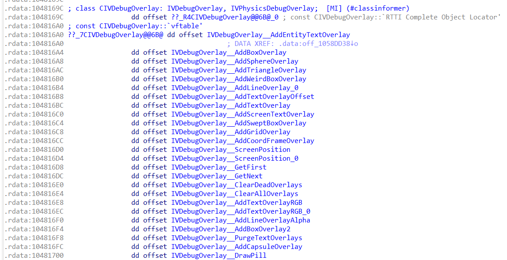
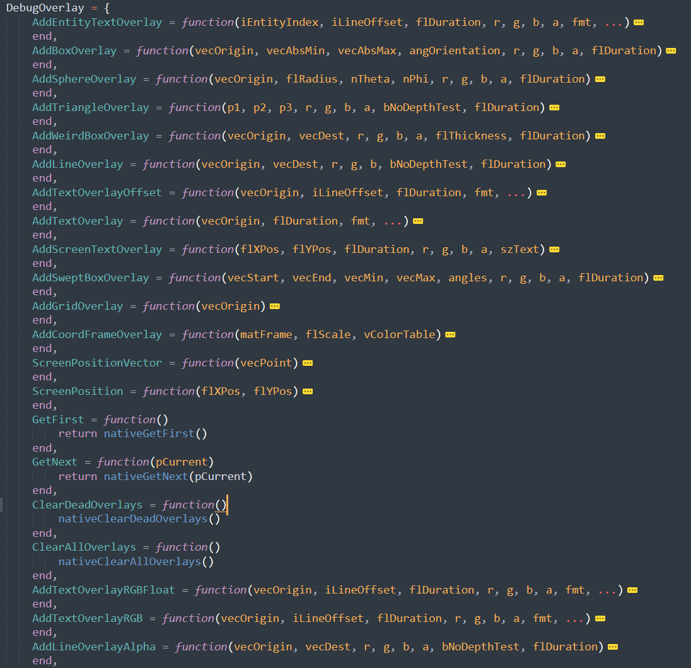
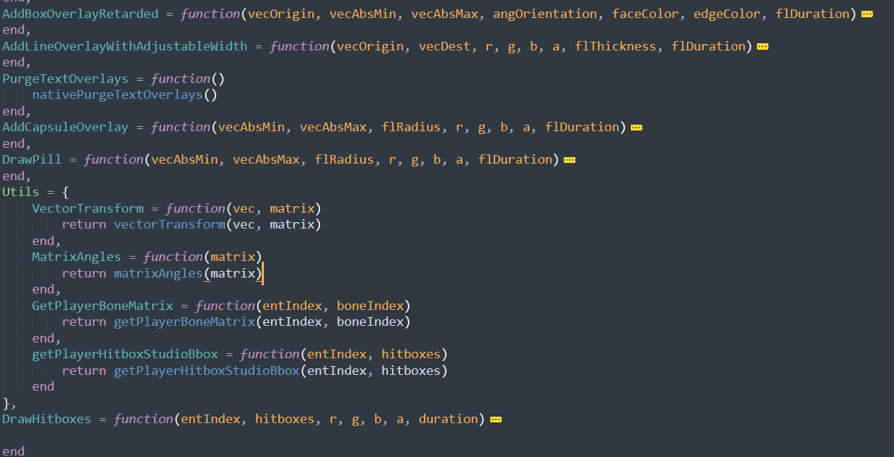

# VDebugOverlay004 interface library

better than primordial debug_overlay in every single way you can imagine.

## info

> author: dhdj\
> version: 1.0

## prerequisite

- [vector library](../../library/vector)

## description

## credits
 - https://github.com/danielkrupinski/Osiris
 - https://github.com/perilouswithadollarsign/cstrike15_src