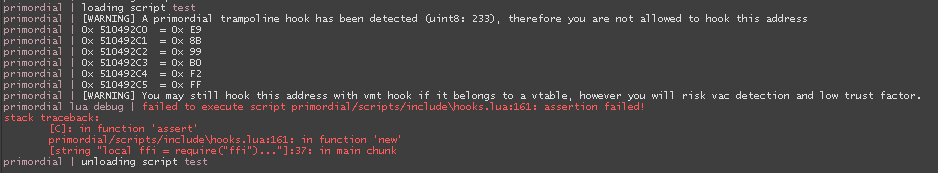

#hooking library

allows you to create vmt hooks & trampoline hooks easily

## info

> author: dhdj\
> version: 1.0

## description

Example vmt hook:

```lua
local ffi = require("ffi")

local hook=require("hooking library")


local function vtable_bind(module, interface, index, type)

    local addr = ffi.cast("void***", memory.create_interface(module, interface)) or error(interface .. " is nil.")

    return ffi.cast(ffi.typeof(type), addr[0][index]), addr

end


local function __thiscall(func, this) -- bind wrapper for __thiscall functions

    return function(...)

        return func(this, ...)

    end

end


local nativeIPanelGetName=__thiscall(vtable_bind("vgui2.dll", "VGUI_Panel009",36,"const char* (__thiscall*)(void*,int)"))


function PaintTraverseHook(originalFunction)

    local originalFunction=originalFunction

    local topPanel=nil

    function PaintTraverse(this,panel,forceRepaint,allowForce)

        if topPanel==nil then

            local name=ffi.string(nativeIPanelGetName(panel))

            if name=="MatSystemTopPanel" then

                topPanel=panel

            end

        end

        if panel==topPanel then

            print("hooked PaintTraverse")

        end

        return originalFunction(this,panel,forceRepaint,allowForce)

    end

    return PaintTraverse

end

local IPanel = hook.vmt.new(memory.create_interface("vgui2.dll", "VGUI_Panel009"))


IPanel.hookMethod("void(__thiscall*)(void*,int,bool,bool)",PaintTraverseHook,41)


local function on_shutdown()

    IPanel.unHookAll()

end


callbacks.add(e_callbacks.SHUTDOWN, on_shutdown)
```


Example trampoline hook would look like this:

```lua
INetChannelHook=hook.jmp.new("int(__thiscall*)(INetChannel*,void*)",SendDatagramHook,ffi.cast("intptr_t**",INetChannelPtr)[0][46],6,true)
```

(had to post it here because my other example script with trampoline hook wasn't approved)


Also a reminder: do not try to hook functions that were already hooked by primordial thru detour.

else you will get the following error:

## credits
- RTD [original script](https://www.blast.hk/threads/55743/)
